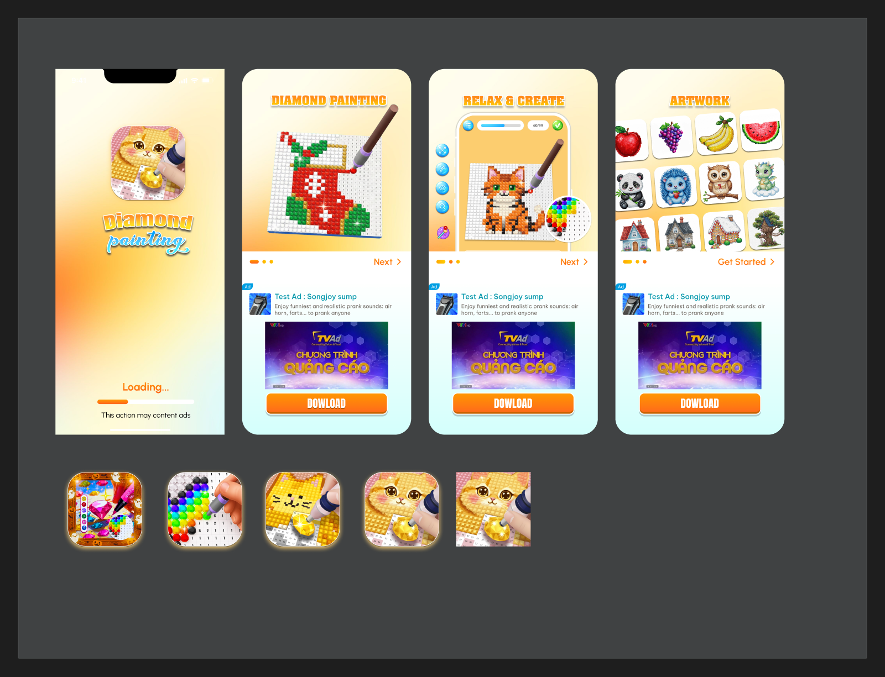
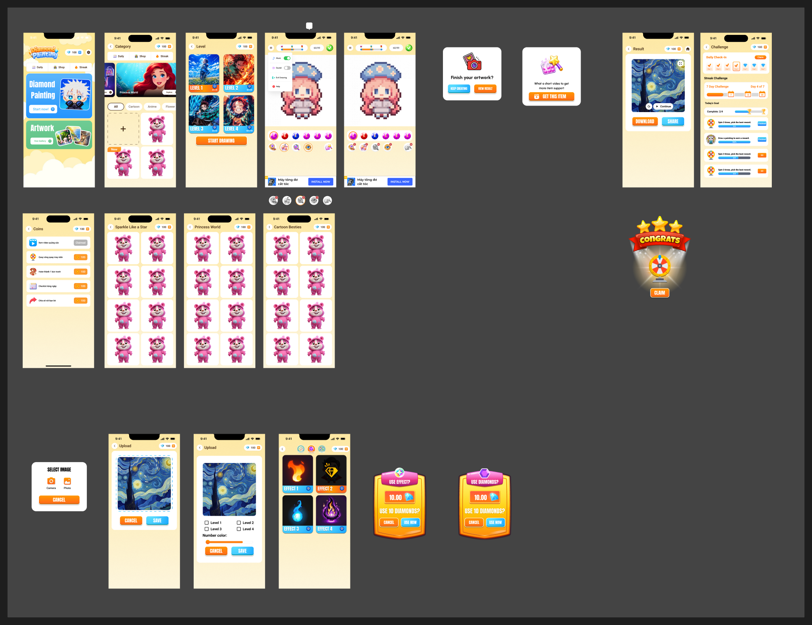
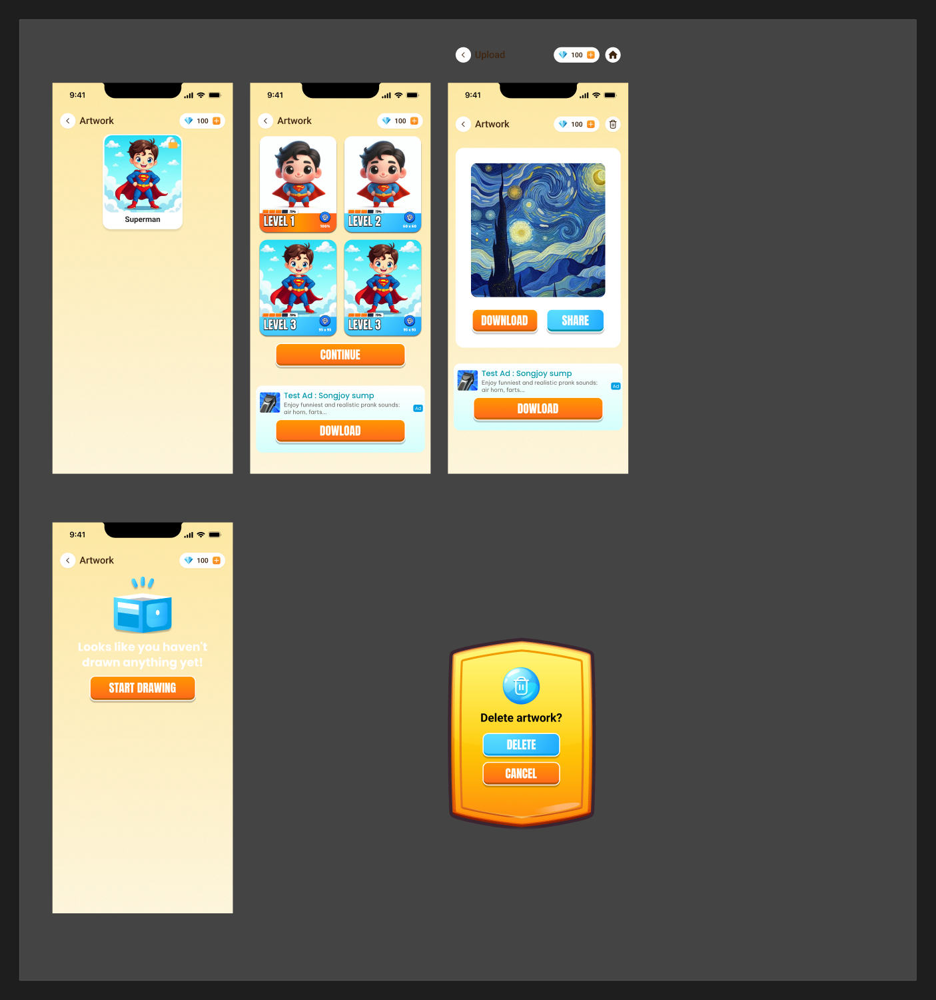

# Báo cáo Audit UI — Diamond Painting

**Ngày audit:** 2026-07-17 · **Nguồn:** [Figma — Audit Diamond](https://www.figma.com/design/lfGHbsUaDacwp80v1epi0g/Audit-Diamond)
**Phạm vi:** 3 section (FTU, ARTWORK, Section 8), ~23 màn hình 375×812, 7 popup, 151 component instance, variables/tokens.

**Đánh giá tổng: 45/100** — Visual style (game art dễ thương, tông vàng-cam ấm) có cá tính và nhất quán ở mức tổng thể, nhưng nền tảng design system gần như chưa có, thiếu nhiều màn hình quan trọng, và có mâu thuẫn logic trong hệ thống tiền tệ (coins vs diamonds).

---

## 1. Kiểm kê màn hình hiện có

**Màn hình:** Splash, Onboarding (Obs_1/2/3), Home, Category (×3), Level select, Màn chơi (×2), Màn kết quả, Challenge/Streak, Kiếm coins, Collection (×3), Upload → Crop → Chọn số màu, Effect, Artwork gallery + detail + empty state. Kèm 5 phương án app icon.

**Popup:** Select Image, Delete artwork?, Finish your artwork?, Use Effect?, Use Diamonds?, Get this item, Congrats (vòng quay).

**Điểm cộng:** đã có empty state cho Artwork; StatusBar/Header/Button đã componentize; luồng upload ảnh đủ 3 bước; onboarding + splash đã bổ sung.

## 2. Design system — thiếu nền tảng nghiêm trọng

### 2.1 Token màu & chữ

| Vấn đề | Bằng chứng | Khuyến nghị |
|---|---|---|
| Chỉ có 3 màu semantic | `Color Primary` #fd9828, `Color Secondary` #51bcfd, `Color Text` #3f2611 | Bảng màu đầy đủ: nền, surface, success/error/warning + thang 100–900 |
| Token "rác" từ 3 kit trộn lẫn | `Label Color/Dark/Primary` (iOS kit), `Roboto/Subtitle 2` (Material kit), `var(--sds-*)` (Figma SDS) | Xóa token thừa, gom về 1 bộ |
| Tên token sai chính tả / giá trị rỗng | `Gradien 1` (thiếu t); `Gradient 2`, `Gradient 3 BG` rỗng giá trị | Sửa tên, định nghĩa gradient thật |
| 2 font hệ thống trộn lẫn | SF Pro Text + Roboto dùng song song | 1 font UI + 1 font display, type scale H1→Caption |
| Không có token spacing/radius | Chỉ có `--sds-size-depth-*` sót lại | Scale spacing 4/8/12/16/24, radius chính thức |

### 2.2 Component

- **Không có page Components riêng** — cần page `🧩 Components` + `🎨 Foundations`.
- **2 component button song song:** `BTN1` (16 instance) và `Button` (9 instance) → hợp nhất 1 Button với variant + size.
- **Không có states:** thiếu pressed / disabled / loading.
- Hàng chục component tên tự sinh `Group 15978xxxxx`.

### 2.3 Đặt tên layer/frame

- 494 frame đa số tên `Frame 15978xxxxx`; 4 frame trùng tên `ARTWORK`, 3 `Category`, 3 `Collection`.
- Trộn tiếng Việt + Anh: `Màn chơi`, `Kiếm coins` cạnh `Category`, `Home`.
- Typo tên: `Efffect`; section `Section 8` vô nghĩa.
- **Quy ước đề xuất:** `[Flow]/[STT] - [Tên màn] - [Biến thể]`, vd `Play/01 - Playing - Menu Open`.

## 3. Màn hình & popup còn thiếu

**🔴 Bắt buộc (UI hiện tại đã tham chiếu tới):**
1. Shop (tab Shop có ở Home + Category nhưng không có màn đích)
2. Màn mua diamond / paywall (nút "+" cạnh số diamond ở mọi màn)
3. Popup "Không đủ diamond"
4. Settings (Home có nút bánh răng)
5. Help (menu màn chơi có mục Help)
6. Màn vòng quay may mắn (mới có popup Congrats)
7. Popup xác nhận Exit Drawing

**🟡 Nên có trước khi ship:**
8. ~~Splash + Onboarding~~ ✅ đã bổ sung 2026-07-17
9. Loading state khi xử lý ảnh upload
10. Error states: upload lỗi, mất mạng, ảnh không hợp lệ
11. Popup xin quyền Camera/Photo
12. Trạng thái rewarded ad (đang xem / nhận thưởng / ad lỗi)
13. Empty state cho Collection và Category

**🟢 Cân nhắc:** Rate app, Remove Ads/Premium, popup pre-ATT (iOS), màn Daily riêng.

## 4. Luồng chưa rõ ràng

1. **Coins vs Diamonds (nghiêm trọng nhất):** màn "Kiếm coins" thưởng xu cam nhưng header toàn app chỉ hiển thị 💎; mọi giao dịch tiêu diamond. Cần chốt 1 hay 2 loại tiền trước khi vẽ thêm.
2. **Luồng upload đứt ở cuối:** …Chọn số màu → Save → *rồi sao?* Chưa có màn thể hiện.
3. **Effect lơ lửng:** chưa rõ entry point (trước khi chơi / trong khi chơi / áp lên kết quả?).
4. **3 tab Daily/Shop/Streak không rõ đích;** là navigation toàn cục hay filter? Cân nhắc bottom tab bar.
5. **Vòng lặp sau Kết quả:** thiếu CTA "Next level / More artworks" giữ retention.

## 5. Lỗi copy & chi tiết trực quan

| Lỗi | Vị trí |
|---|---|
| "**Vew** Gallery" → "View Gallery" | Card Artwork ở Home |
| "**DOWLOAD**" → "DOWNLOAD" | Nút ad ở Artwork detail, Result, và cả 3 màn Obs_1/2/3 |
| "This action may **content** ads" → "may **contain** ads" | Splash |
| `Efffect`, `Gradien 1` | Tên frame & variable |
| 3 phong cách popup khác nhau (trắng phẳng / khiên vàng / khiên hồng-vàng) | Chọn 1 hệ popup game-style, làm component có slot |
| Nút Delete màu xanh nổi hơn Cancel trong popup xóa | Hành động destructive nên là đỏ/outline |
| Text trắng trên nền vàng nhạt, tương phản ~1.8:1 (chuẩn 4.5:1) | Empty state Artwork, chữ "Upload" |
| Menu màn chơi không có scrim phía sau | Màn chơi |
| Status bar/notch render lệch nhau giữa các màn | Nhiều màn |

## 6. Lộ trình ưu tiên

1. **Tuần 1** — Chốt logic tiền tệ; vẽ Shop + paywall + popup thiếu diamond.
2. **Tuần 1** — Dọn foundation: page Foundations (màu, type, spacing), xóa token rác, chốt 1 font.
3. **Tuần 2** — Hợp nhất component (Button, Popup, Header, Card); đổi tên frame theo quy ước.
4. **Tuần 2–3** — Vẽ màn thiếu nhóm 🔴; nối luồng upload + effect khép kín.
5. **Tuần 3** — Polish: sửa typo, thống nhất status bar, sửa contrast, CTA chơi tiếp ở Kết quả, loading/error states.
